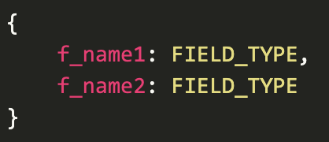

# Проект form_detector

### Описание
В этом проекте представлено Web-приложение для определения заполненных форм. В проекте используется база данных tinyDB. В ней хранится список шаблонов форм. Шаблон формы, это структура, которая задается уникальным набором полей, с указанием их типов.
Пример шаблона формы:
- 

Всего поддерживается четыре типа данных полей: 
- email
- телефон
- дата
- текст

Все типы кроме текста поддерживают валидацию. Телефон передается в стандартном формате +7 xxx xxx xx xx, дата передается в формате DD.MM.YYYY или YYYY.MM.DD

На вход по урлу /get_form POST запросом передаются данные такого вида:
f_name1=value1&f_name2=value2

В ответ возвращается имя шаблона формы, если она была найдена.

Если подходящей формы не нашлось, ответ в следующем формате:
- 
где FIELD_TYPE это тип поля, выбранный на основе правил валидации, проверка производиться в следующем порядке:
дата, телефон, email, текст.


### Технологии
- Python 3.10
- Django 4.2.7
- tinydb 4.8.0
- json

### Используемые сторонние модули
- phonenumbers 8.13.25
- requests 2.31.0


### Как запустить и протестировать проект:

Клонировать репозиторий и перейти в него в командной строке:

```
git clone git@github.com:OlegMusatov3000/form_detector.git
```

```
cd form_detector
```

Cоздать виртуальное окружение:

- Команда для Windows

```
python -m venv venv
```

- Для Linux и macOS:

```
python3.10 -m venv venv
```

Активировать виртуальное окружение:

- Команда для Windows:

```
source venv/Scripts/activate
```

- Для Linux и macOS:

```
source venv/bin/activate
```

Установить зависимости из файла requirements.txt:

```
python -m pip install --upgrade pip
```

```
pip install -r requirements.txt
```

В новом окне терминала в папке с файлом manage.py запустить скрипт наполнения базы данных тестовыми формами:

```
python manage.py load_db
```

В случае успешного наполнения базы данных в окне терминале вы увидите запись:

```
✅ Data saved successfully!
```

Если вы хотите выполнить несколько тестовых запросов вы можете прописать следующую команду:

```
python manage.py make_test_requests
```

При работе этого скрипта будет выполнено 3 тестовых запроса с разными наборами тестовых параметров и в терминале вы увидите результат этих post запросов

```
Test 1: {'template_name': 'Form'}
Test 2: {'template_name': 'OnlyText'}
Test 3: {'f_name3': 'text', 'f_name9': 'date'}
```

### Небольшое примечание
Этот readme был написан для удобного и понятного тестирования проекта. Пожалуйста оцените мои старания и предоставьте обратную связь в TG что можно было бы улучшить и чего не хватает для удовлетвория ваших ожиданий

- Tg: @OlegMusatov

### Автор проекта 
- Олег Мусатов
- Tg: @OlegMusatov